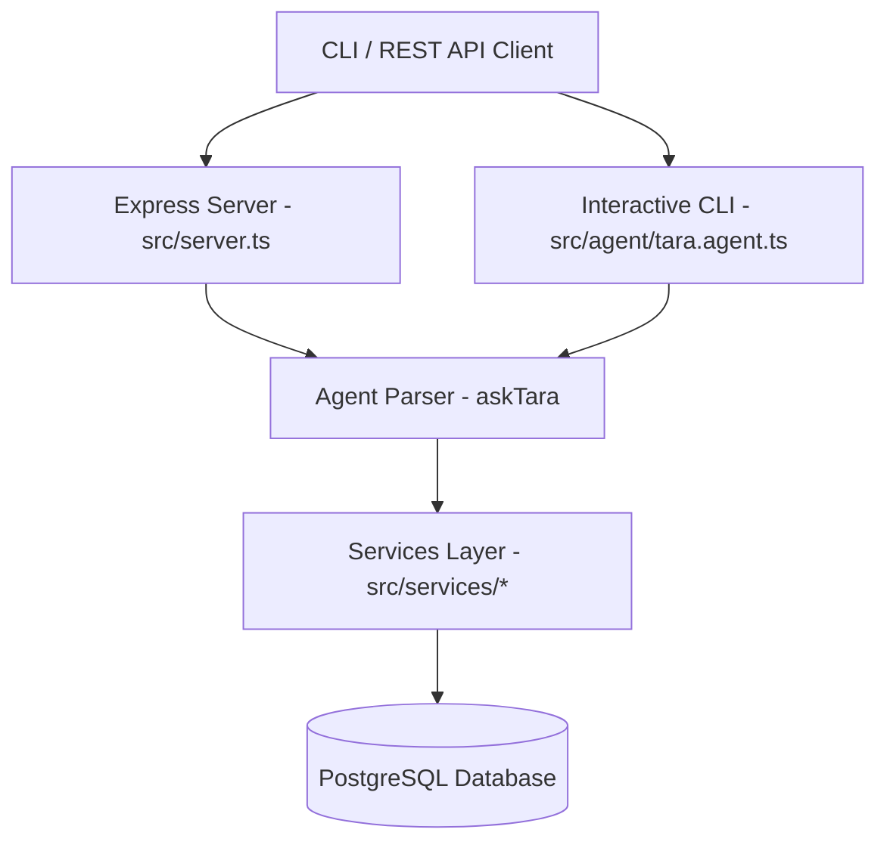

# Tara Financial Agent - System Design Document 📐✏️

This document outlines the architecture, database schema, component layout, and query processing flow of the **Tara Financial Agent**.

---

## 🏗️ System Architecture

The project is structured as a decoupled three-tier system:



1. **Client / Interface Layer**: Handles communication with the user.
   - **CLI Mode**: A direct readline-based terminal interface.
   - **Express Server**: Exposes an HTTP POST `/ask` endpoint.
2. **Agent Layer (`src/agent/`)**:
   - Parses incoming query strings using RegEx and keyword extraction.
   - Resolves intent and maps it to specific queries in the services layer.
3. **Services Layer (`src/services/`)**:
   - Implements SQL queries using parameterized operations through `pg` (PostgreSQL client pool).
   - Encapsulates database calls into three distinct modules: `fund.service.ts`, `portfolio.service.ts`, and `transaction.service.ts`.
4. **Database Layer (`scripts/schema.sql`)**:
   - Persists data in four relational tables representing funds, NAV histories, current holdings, and transactions.

---

## 🗄️ Database Design & Schema

The PostgreSQL database schema consists of the following tables:

### 1. `funds` Table
Stores metadata for available mutual funds.
```sql
CREATE TABLE funds (
    id VARCHAR(100) PRIMARY KEY,
    name VARCHAR(255) NOT NULL,
    category VARCHAR(100) NOT NULL
);
```

### 2. `fund_nav` Table
Stores time-series NAV (Net Asset Value) data for mutual funds.
```sql
CREATE TABLE fund_nav (
    fund_id VARCHAR(100) REFERENCES funds(id) ON DELETE CASCADE,
    date DATE NOT NULL,
    value NUMERIC(15, 4) NOT NULL,
    PRIMARY KEY (fund_id, date)
);
```

### 3. `holdings` Table
Stores current active portfolio holdings, detailing the original purchase date and cost basis.
```sql
CREATE TABLE holdings (
    fund_id VARCHAR(100) PRIMARY KEY REFERENCES funds(id) ON DELETE CASCADE,
    fund_name VARCHAR(255) NOT NULL,
    units NUMERIC(15, 4) NOT NULL,
    purchase_date DATE NOT NULL,
    purchase_nav NUMERIC(15, 4) NOT NULL
);
```

### 4. `transactions` Table
Stores chronological expense and income logs.
```sql
CREATE TABLE transactions (
    id VARCHAR(100) PRIMARY KEY,
    date DATE NOT NULL,
    merchant VARCHAR(255) NOT NULL,
    category VARCHAR(100) NOT NULL,
    amount NUMERIC(15, 4) NOT NULL,
    currency VARCHAR(10) NOT NULL,
    memo TEXT
);
```

---

## 🧠 Query & Intent Parser Strategy

The natural language processing of **Tara** is rule-based and uses regular expressions combined with keyword checks. The parser logic handles:

1. **Portfolio Calculations**:
   - *Portfolio Value*: Sums `units * latest_nav` across all holdings.
   - *ROI*: Computes absolute and percentage gains relative to the total cost basis (`units * purchase_nav`).
2. **Transaction Analysis**:
   - Analyzes category-wise spend, time-interval limits, monthly breakdowns, and merchant aggregations.
3. **Mutual Fund Evaluation**:
   - Fetches historical performance and return profiles over arbitrary date ranges using:
     $$\text{Return (\%)} = \frac{NAV_{\text{end}} - NAV_{\text{start}}}{NAV_{\text{start}}} \times 100$$

---

## 📁 Directory Structure

```text
Tara-Financial-Agent/
├── data/                    # JSON source datasets (sample_a, sample_b, etc.)
├── scripts/
│   ├── schema.sql           # Database schema definition
│   ├── ingest.ts            # Script to wipe database and ingest JSON data
│   └── evaluate.ts          # Compares service layer queries against raw JSON
├── src/
│   ├── agent/
│   │   └── tara.agent.ts    # CLI loop & Query router/parser logic
│   ├── db/
│   │   └── connection.ts    # PostgreSQL pg.Pool configuration
│   ├── services/
│   │   ├── fund.service.ts  # NAV & historical fund return services
│   │   ├── portfolio.service.ts # Portfolio worth and holding ROI services
│   │   └── transaction.service.ts # Expenses, merchants, and categories services
│   └── server.ts            # Express server configuration
├── .env                     # Local environment parameters (Ignored by git)
├── .gitignore               # Ignored files list
├── tsconfig.json            # TypeScript configuration
└── package.json             # NPM package and script scripts definition
```
